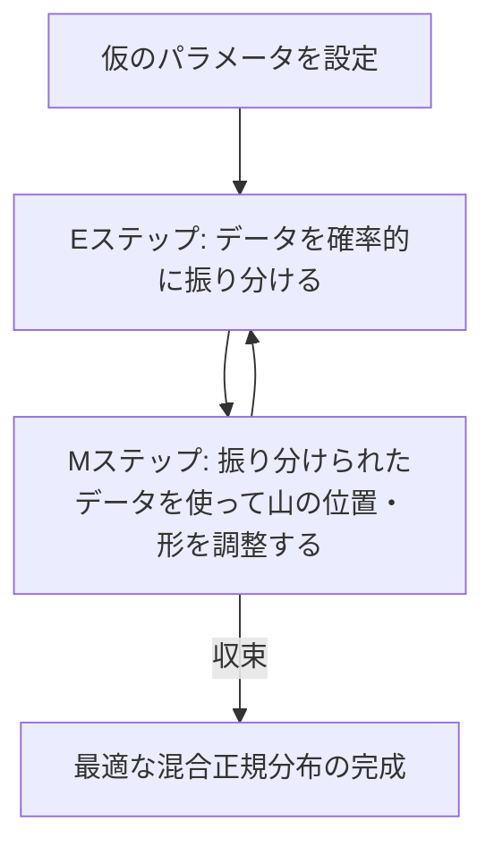

# 混合正規分布 (GMM) における EM アルゴリズムの直感的解釈（お気持ち）

本稿では、混合正規分布 (Gaussian Mixture Model; GMM) と、それを解くための EM アルゴリズムについて、数理的背景を交えながら直感的なイメージ（お気持ち）を分かりやすく解説する。

---

## 1. そもそも「潜在変数 (Latent Variable)」とは？

### 直感的イメージ：記録し忘れた「隠されたラベル」
潜在変数とは、**「本来は存在するはずだが、観測データには記録されていない隠された情報」**のことである。

例えば、日本人の身長データ $X = \{\bm{x}_1, \bm{x}_2, \dots, \bm{x}_N\}$ を集めたとする。
*   もし「男性」「女性」という性別ラベルが記録されていれば、男性のデータだけを集めて平均・分散を計算し、女性のデータだけを集めて平均・分散を計算すればよい（これは簡単である）。
*   しかし、**「性別ラベルを記録し忘れた」**とする。手元にあるのは、男と女の分布が重なり合って2つの山を持つ「混合正規分布」のデータだけである。

このとき、各データ点 $\bm{x}_n$ に対して、**「本当は男性グループなのか、女性グループなのか」を示す隠されたグループ情報**を $z_n$ と置き、これを **潜在変数** と呼ぶ。
具体的には、以下のような「グループへの所属を表す one-hot ベクトル」として表現されることが多い。

$$
\bm{z}_n = (z_{n1}, z_{n2}, \dots, z_{nK})^T \quad (\text{ただし、データ } n \text{ がグループ } k \text{ に属するなら } z_{nk}=1, \text{ それ以外は } 0)
$$

---

## 2. 各変数の「お気持ち」

スライドに出てくる変数 $\pi_k$ と $\gamma(z_{nk})$ は、それぞれ以下の直感的な意味を持っている。

### ① 混合比率 $\pi_k$ のお気持ち
*   **直感**：**「そのグループが母集団全体の中で占める割合（事前確率）」**である。
*   **例**：日本人のデータにおいて「男性が全体の $50\%$、女性が $50\%$」であれば、$\pi_1 = 0.5$, $\pi_2 = 0.5$ となる。
*   すべてのグループの比率の和は $1$ になる性質を持つ。
    $$
    \sum_{k=1}^K \pi_k = 1 \quad (\pi_k \geq 0)
    $$

### ② 負担率 (Responsibility) $\gamma(z_{nk})$ のお気持ち
*   **直感**：**「データ点 $\bm{x}_n$ が、グループ $k$（山 $k$）から生成された確率（事後確率）」**である。
*   **例**：身長が $175\mathrm{cm}$ のデータ点 $\bm{x}_n$ があったとき、「この人は $80\%$ の確率で男性グループから、$20\%$ の確率で女性グループから来た」と推測されるなら、$\gamma(z_{n1}) = 0.8$, $\gamma(z_{n2}) = 0.2$ となる。

この値は、ベイズの定理に基づいて以下のように計算される。

$$
\gamma(z_{nk}) = P(z_{nk} = 1 \mid \bm{x}_n) = \frac{\pi_k \mathcal{N}(\bm{x}_n \mid \bm{\mu}_k, \Sigma_k)}{\sum_{j=1}^K \pi_j \mathcal{N}(\bm{x}_n \mid \bm{\mu}_j, \Sigma_j)}
$$

*   **分子**：グループ $k$ が選ばれる確率 $\pi_k$ $\times$ そのグループ内で値 $\bm{x}_n$ が観測される確率（尤度）。
*   **分母**：すべてのグループについてのその和（データ $\bm{x}_n$ が観測される全体の確率）。

---

## 3. EM アルゴリズムのジレンマと解決策

GMM を解くにあたって、私たちは以下のジレンマ（鶏が先か卵が先か）に直面する。

1.  **「各データがどのグループに属するか（潜在変数 $\bm{z}_n$）」が分かっていれば**、グループごとにデータを分けて、平均 $\bm{\mu}_k$ や分散 $\Sigma_k$ を普通の最尤推定で簡単に求められる。
2.  **「各グループの平均 $\bm{\mu}_k$ や分散 $\Sigma_k$」が分かっていれば**、各データがどのグループに属する確率が高いか（負担率 $\gamma(z_{nk})$）を正確に計算できる。
3.  **しかし、実際にはどちらも分からない。**

このジレンマを解決するために、**「まず仮のパラメータを決め、一方を固定して他方を更新する」というステップを交互に繰り返す** のが EM アルゴリズムである。

---

## 4. Eステップ と Mステップ の「お気持ち」

### 🔁 Eステップ (Expectation Step)：ソフトなグループ分け
*   **お気持ち**：**「現在の仮のパラメータ（平均・分散・比率）を真実だと信じて、各データ点 $\bm{x}_n$ がどの山に所属していそうかの確率（期待値）を計算する」**ステップ。
*   データを「あなたは男性！」「あなたは女性！」とデジタルに決めるのではなく、「男性である確率が $70\%$、女性である確率が $30\%$」のようにソフトに（確率的に）割り振るのがポイントである。

$$
\gamma(z_{nk}) \text{ を現在のパラメータ } \{\pi_k, \bm{\mu}_k, \Sigma_k\} \text{ を用いて評価する。}
$$

### 🔁 Mステップ (Maximization Step)：重み付きパラメータの更新
*   **お気持ち**：**「Eステップで求めた所属確率（負担率） $\gamma(z_{nk})$ を重みとして使って、各グループのパラメータを最尤推定（最大化）する」**ステップ。

スライドに書かれている Mステップの式を観察すると、すべて **$\gamma(z_{nk})$ を重みとする加重平均** の形になっていることが分かる。

*   **有効データ数 $N_k$**：
    $$
    N_k = \sum_{n=1}^N \gamma(z_{nk})
    $$
    単にデータの個数を数えるのではなく、「各データがどれだけグループ $k$ っぽいか（確率）」を足し合わせた、グループ $k$ の実質的なデータ数。

*   **平均値 $\bm{\mu}_k$ の更新**：
    $$
    \bm{\mu}_k = \frac{1}{N_k} \sum_{n=1}^N \gamma(z_{nk}) \bm{x}_n
    $$
    グループ $k$ への所属確率 $\gamma(z_{nk})$ を重みとした、データ $\bm{x}_n$ の加重平均。グループ $k$ っぽいデータほど、新しい平均値の計算に強く寄与する。

*   **共分散行列 $\Sigma_k$ の更新**：
    $$
    \Sigma_k = \frac{1}{N_k} \sum_{n=1}^N \gamma(z_{nk}) (\bm{x}_n - \bm{\mu}_k)(\bm{x}_n - \bm{\mu}_k)^T
    $$
    同様に、所属確率を重みとした加重分散。

*   **混合比率 $\pi_k$ の更新**：
    $$
    \pi_k = \frac{N_k}{N}
    $$
    実質的なデータ数 $N_k$ を全体のデータ数 $N$ で割ることで、新しいグループ存在比率を計算する。

---

## 5. まとめ

EM アルゴリズムの繰り返しは、以下のような調整のらせん階段を登っているイメージである。

この操作を繰り返すたびに、対数尤度（データがそのモデルから生成される確率）は必ず単調増加することが数学的に保証されており、やがて最適な山の配置（極大解）にたどり着く。
